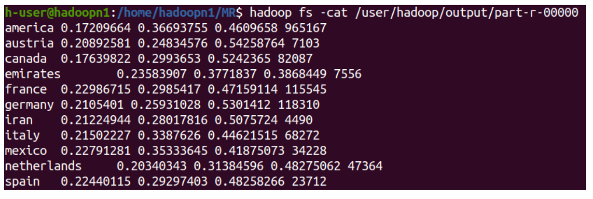

# Cloud Computing Homeworks

## HW1: Working with Cloud Services
Developing and deploying an art gallery website with cloud services.
- IBM cloud for Text-to-Speech (on user comments).
- Arvan Object Storage service for storing images.
- Fandogh PaaS for deploying the server.

## HW2: Docker & K8s Basics
Deploying a simple server on a K8s cluster with the help of Docker and minikube.

## HW3: Data Mining with Apache Hadoop
Performing data mining tasks on the US election dataset in a distributed manner with the help of MapReduce framework in Apache Hadoop.

The dataset cosists of ~2 million Tweets regarding the US election in 2020.

- Set up a 3-node Hadoop cluster on virtual machines.
- Set up Hadoop Distributed File System (HDFS) on the cluster to store the dataset.
- Wrote MapReduce code in Java to calculate the number of likes and retweets related to each candidate, number of tweets in each country, etc.

#### Results:
The percentage of tweets related to Trump, Biden, or Both, and the total number of tweets in each country:

  

